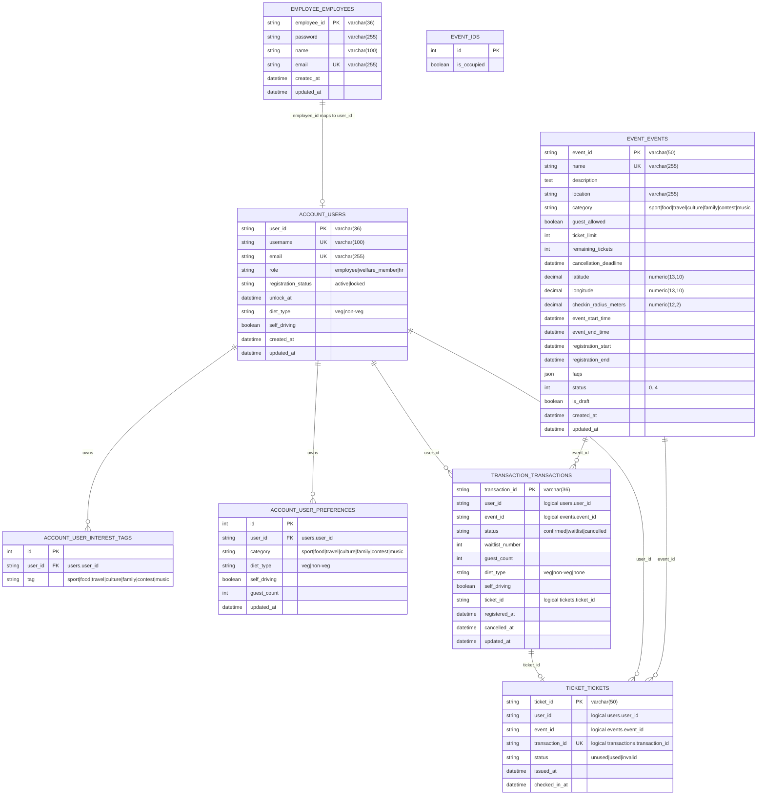
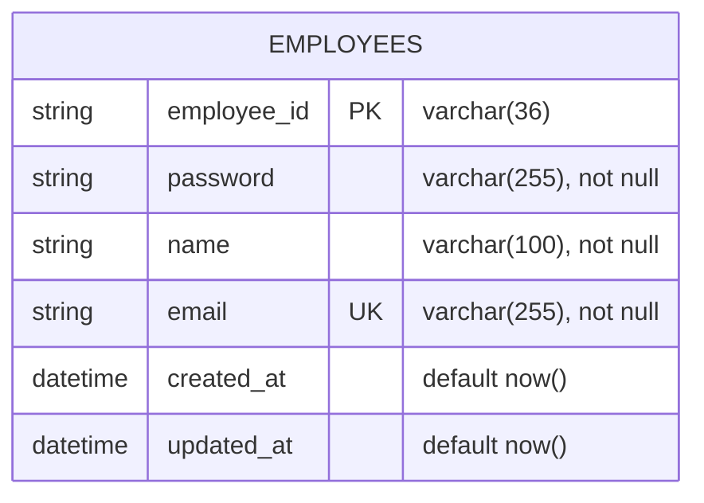
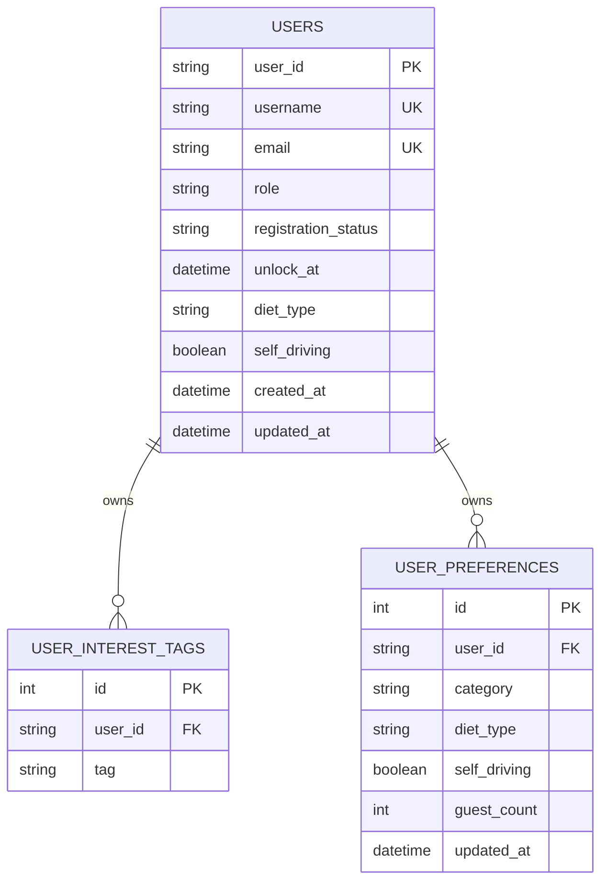
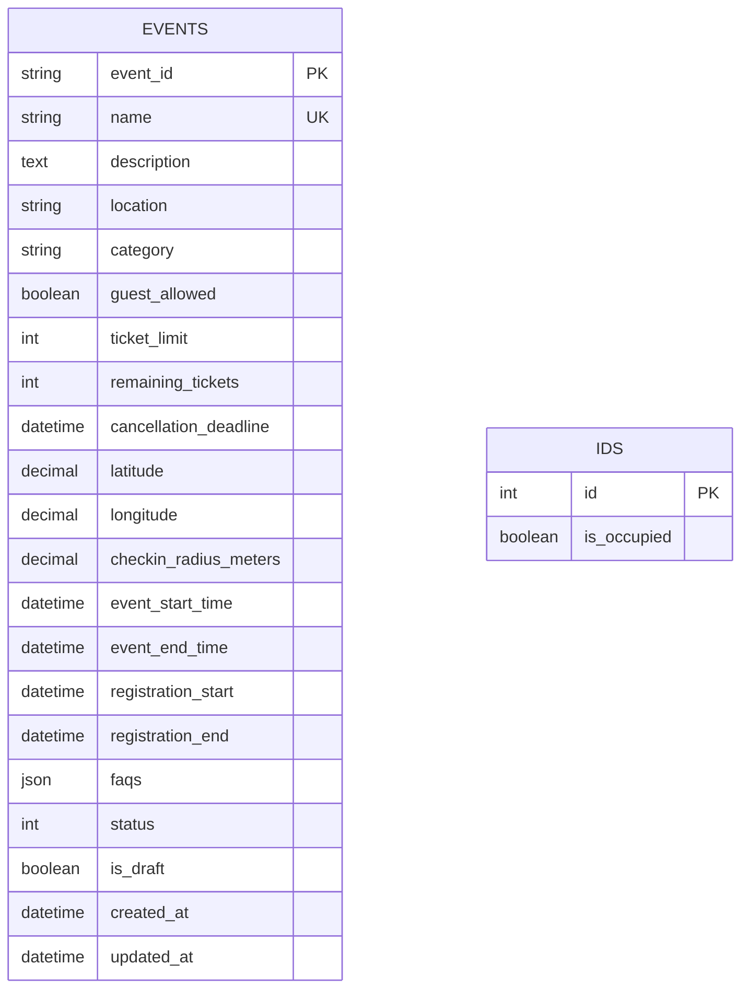
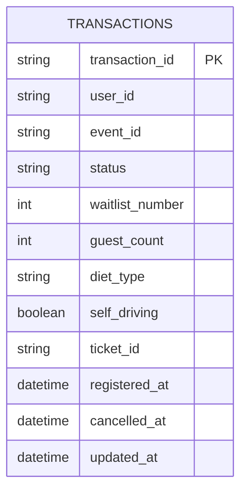
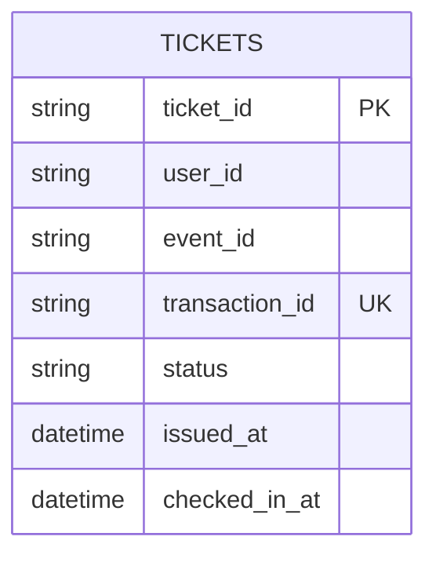

# Database Schema

This document describes the current database layout for the event ticketing system.

The backend is split by service database. Cross-service references are stored as IDs, but they are not enforced by database-level foreign keys because each service owns its own database.

## Database Overview

| Database | Owner | Tables |
|---|---|---|
| `employee_db` | External employee auth data | `employees` |
| `account_db` | Account Service | `users`, `user_interest_tags`, `user_preferences` |
| `event_db` | Event Service | `events`, `ids` |
| `transaction_db` | Transaction Service | `transactions` |
| `ticket_db` | Ticket Service | `tickets` |

## Cross-Database ER Model

Dashed/implicit relationships below are logical references only. They are not database-level foreign keys.

## `employee_db`

External employee credential database used by Account Service when `EMPLOYEE_AUTH_MODE=database`.

### `employees`

| Column | Type | Nullable | Default | Constraints / Notes |
|---|---:|---:|---|---|
| `employee_id` | `VARCHAR(36)` | No | - | Primary key |
| `password` | `VARCHAR(255)` | No | - | Used by database auth mode |
| `name` | `VARCHAR(100)` | No | - | Employee display name |
| `email` | `VARCHAR(255)` | No | - | Unique |
| `created_at` | `TIMESTAMPTZ` | No | `NOW()` | Created timestamp |
| `updated_at` | `TIMESTAMPTZ` | No | `NOW()` | Updated timestamp |

## `account_db`

Account Service stores application users, roles, registration lock state, interest tags, and autofill preferences.

### Account ER Model

### `users`

| Column | Type | Nullable | Default | Constraints / Notes |
|---|---:|---:|---|---|
| `user_id` | `VARCHAR(36)` | No | - | Primary key. Usually maps to `employee_db.employees.employee_id`. |
| `username` | `VARCHAR(100)` | No | - | Unique |
| `email` | `VARCHAR(255)` | No | - | Unique |
| `role` | `VARCHAR(20)` | No | `employee` | Check: `employee`, `welfare_member`, `hr` |
| `registration_status` | `VARCHAR(10)` | No | `active` | Check: `active`, `locked` |
| `unlock_at` | `TIMESTAMPTZ` | Yes | `NULL` | Lock expiry timestamp |
| `diet_type` | `VARCHAR(10)` | Yes | `non-veg` | Check: `veg`, `non-veg` |
| `self_driving` | `BOOLEAN` | Yes | `NULL` | Default autofill value |
| `created_at` | `TIMESTAMPTZ` | No | `NOW()` | Created timestamp |
| `updated_at` | `TIMESTAMPTZ` | No | `NOW()` | Updated timestamp |

### `user_interest_tags`

| Column | Type | Nullable | Default | Constraints / Notes |
|---|---:|---:|---|---|
| `id` | `INTEGER` | No | autoincrement | Primary key |
| `user_id` | `VARCHAR(36)` | No | - | FK to `users.user_id`, `ON DELETE CASCADE` |
| `tag` | `VARCHAR(50)` | No | - | Check: `sport`, `food`, `travel`, `culture`, `family`, `contest`, `music` |

Constraints:

| Name | Definition |
|---|---|
| `UNIQUE(user_id, tag)` | A user cannot have the same interest tag twice. |

### `user_preferences`

| Column | Type | Nullable | Default | Constraints / Notes |
|---|---:|---:|---|---|
| `id` | `INTEGER` | No | autoincrement | Primary key |
| `user_id` | `VARCHAR(36)` | No | - | FK to `users.user_id`, `ON DELETE CASCADE` |
| `category` | `VARCHAR(50)` | No | - | Check: `sport`, `food`, `travel`, `culture`, `family`, `contest`, `music` |
| `diet_type` | `VARCHAR(10)` | Yes | `NULL` | Check: `veg`, `non-veg` |
| `self_driving` | `BOOLEAN` | Yes | `NULL` | Category-specific autofill |
| `guest_count` | `INTEGER` | Yes | `NULL` | Category-specific autofill |
| `updated_at` | `TIMESTAMPTZ` | No | `NOW()` | Updated timestamp |

Constraints:

| Name | Definition |
|---|---|
| `UNIQUE(user_id, category)` | A user has at most one preference row per category. |

## `event_db`

Event Service owns activity/event data and reusable event numeric IDs.

### Event ER Model

`ids` is not a child table of `events`. It tracks reusable numeric event IDs. For example, `events.event_id = 'event_12'` corresponds to `ids.id = 12` by convention.

### `events`

| Column | Type | Nullable | Default | Constraints / Notes |
|---|---:|---:|---|---|
| `event_id` | `VARCHAR(50)` | No | - | Primary key, indexed |
| `name` | `VARCHAR(255)` | No | - | Unique (`uq_events_name`) |
| `description` | `TEXT` | No | - | Event description |
| `location` | `VARCHAR(255)` | No | - | Event location |
| `category` | `VARCHAR(50)` | Yes | `NULL` | Check: `sport`, `food`, `travel`, `culture`, `family`, `contest`, `music` |
| `guest_allowed` | `BOOLEAN` | No | `false` | Whether guests are allowed |
| `ticket_limit` | `INTEGER` | Yes | `NULL` | Capacity limit. `NULL` means no explicit limit. |
| `remaining_tickets` | `INTEGER` | No | `0` | Remaining capacity |
| `cancellation_deadline` | `TIMESTAMPTZ` | Yes | `NULL` | Last cancellation time |
| `latitude` | `NUMERIC(13,10)` | Yes | `NULL` | Check-in latitude |
| `longitude` | `NUMERIC(13,10)` | Yes | `NULL` | Check-in longitude |
| `checkin_radius_meters` | `NUMERIC(12,2)` | Yes | `NULL` | Check-in radius |
| `event_start_time` | `TIMESTAMPTZ` | No | - | Event start |
| `event_end_time` | `TIMESTAMPTZ` | No | - | Event end |
| `registration_start` | `TIMESTAMPTZ` | No | - | Registration start |
| `registration_end` | `TIMESTAMPTZ` | No | - | Registration end |
| `faqs` | `JSON` | Yes | `[]` | FAQ array |
| `status` | `INTEGER` | No | `0` | `0=not_open`, `1=registering`, `2=waitlist`, `3=closed`, `4=ended` |
| `is_draft` | `BOOLEAN` | No | `true` | Draft flag |
| `created_at` | `TIMESTAMPTZ` | No | `NOW()` | Created timestamp |
| `updated_at` | `TIMESTAMPTZ` | Yes | `NULL` | Updated on update |

Indexes:

| Name | Columns |
|---|---|
| `ix_events_event_id` | `event_id` |
| `ix_events_category` | `category` |

### `ids`

| Column | Type | Nullable | Default | Constraints / Notes |
|---|---:|---:|---|---|
| `id` | `INTEGER` | No | - | Primary key, indexed |
| `is_occupied` | `BOOLEAN` | No | `false` | Whether this numeric ID is currently occupied |

## `transaction_db`

Transaction Service owns registration records. Cancellation keeps the row and changes `status` to `cancelled`.

### Transaction ER Model

### `transactions`

| Column | Type | Nullable | Default | Constraints / Notes |
|---|---:|---:|---|---|
| `transaction_id` | `VARCHAR(36)` | No | - | Primary key |
| `user_id` | `VARCHAR(36)` | No | - | Logical ref: `account_db.users.user_id` |
| `event_id` | `VARCHAR(50)` | No | - | Logical ref: `event_db.events.event_id` |
| `status` | `VARCHAR(20)` | No | `confirmed` | Check: `confirmed`, `waitlist`, `cancelled` |
| `waitlist_number` | `INTEGER` | Yes | `NULL` | Queue number when waitlisted |
| `guest_count` | `INTEGER` | No | `0` | Check: `guest_count >= 0` |
| `diet_type` | `VARCHAR(10)` | Yes | `NULL` | Check: `veg`, `non-veg`, `none` |
| `self_driving` | `BOOLEAN` | Yes | `NULL` | Registration form value |
| `ticket_id` | `VARCHAR(36)` | Yes | `NULL` | Logical ref: `ticket_db.tickets.ticket_id`; only confirmed registrations normally have tickets |
| `registered_at` | `TIMESTAMPTZ` | No | `NOW()` | Registration timestamp |
| `cancelled_at` | `TIMESTAMPTZ` | Yes | `NULL` | Cancellation timestamp |
| `updated_at` | `TIMESTAMPTZ` | No | `NOW()` | Updated timestamp |

Indexes and constraints:

| Name | Definition |
|---|---|
| `ix_transactions_event_status` | Index on `(event_id, status)` |
| `ix_transactions_user_id` | Index on `user_id` |
| `uq_active_registration` | Partial unique index on `(user_id, event_id)` where `status IN ('confirmed','waitlist')` |

## `ticket_db`

Ticket Service owns issued tickets and check-in state.

### Ticket ER Model

### `tickets`

| Column | Type | Nullable | Default | Constraints / Notes |
|---|---:|---:|---|---|
| `ticket_id` | `VARCHAR(50)` | No | generated `tk_` ID | Primary key |
| `user_id` | `VARCHAR(36)` | No | - | Logical ref: `account_db.users.user_id`; indexed |
| `event_id` | `VARCHAR(50)` | No | - | Logical ref: `event_db.events.event_id`; indexed |
| `transaction_id` | `VARCHAR(50)` | No | - | Logical ref: `transaction_db.transactions.transaction_id`; unique |
| `status` | `VARCHAR(20)` | No | `unused` | Intended values: `unused`, `used`, `invalid` |
| `issued_at` | `TIMESTAMPTZ` | Yes | current UTC time | Ticket issue timestamp |
| `checked_in_at` | `TIMESTAMPTZ` | Yes | `NULL` | Set when ticket is checked in |

Indexes and constraints:

| Name | Definition |
|---|---|
| `ix_tickets_user_id` | Index on `user_id` |
| `ix_tickets_event_id` | Index on `event_id` |
| `UNIQUE(transaction_id)` | One ticket per transaction |

## Status Notes

### Event Status

| Value | API Value | Meaning |
|---:|---|---|
| `0` | `not_open` | Registration has not opened |
| `1` | `registering` | Registration is open |
| `2` | `waitlist` | Waitlist mode |
| `3` | `closed` | Registration closed |
| `4` | `ended` | Event has ended |

### Transaction Status

| Value | Meaning |
|---|---|
| `confirmed` | Registration has a confirmed seat |
| `waitlist` | Registration is on waitlist |
| `cancelled` | User cancelled registration |

### Ticket Status

| Value | Meaning |
|---|---|
| `unused` | Issued and not checked in |
| `used` | Checked in |
| `invalid` | Intended invalid status. Current API also derives invalid display state dynamically when an unused ticket is outside event time. |

## Autofill Notes

When a user registers for an event, autofill values are resolved in this order:

1. `account_db.user_preferences` for the event `category`.
2. Fallback to `account_db.users.diet_type` / `account_db.users.self_driving`.

## Cleanup Notes

When Event Service deletes an event, it calls internal APIs to clean up related resources:

1. Ticket Service deletes `ticket_db.tickets` rows matching `event_id`.
2. Transaction Service deletes `transaction_db.transactions` rows matching `event_id`.
3. Event Service deletes the `event_db.events` row and releases the numeric ID in `event_db.ids`.
