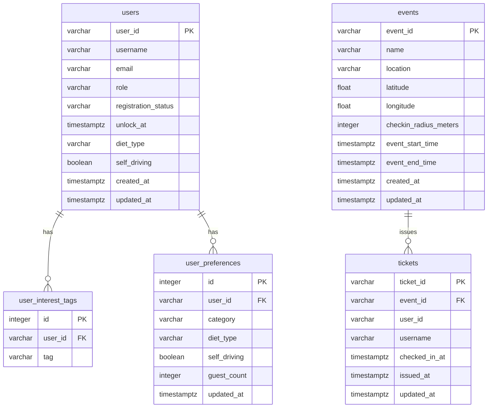
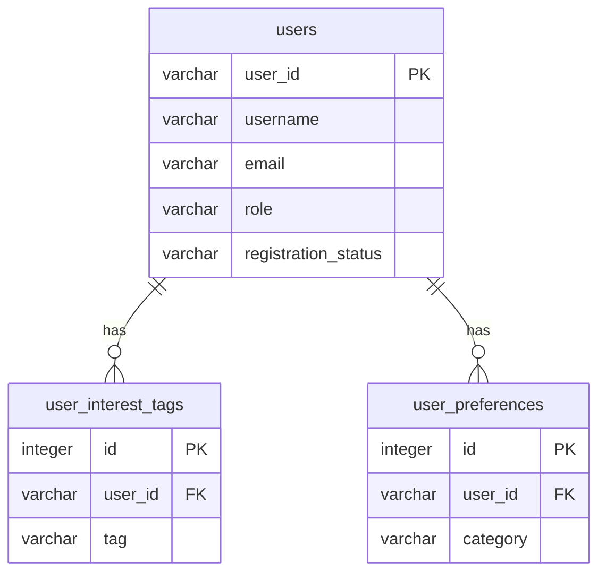
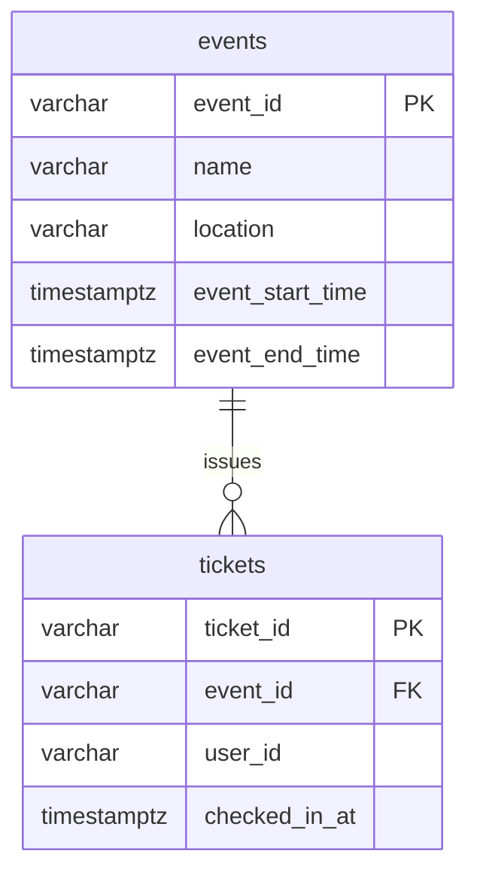

# Backend — Database Schema 文件

## 總覽

本專案目前採用 monolith backend，所有資料表都放在同一個 PostgreSQL database。

| Database | 說明 |
|---|---|
| `event_ticketing_db` | 本機開發與正式執行使用的主要 database |
| `test_event_ticketing_db` | 測試使用的 database |

目前共有五張主要業務表：

| Domain | 表名 | 說明 |
|---|---|---|
| Account | `users` | 使用者基本資料 |
| Account | `user_interest_tags` | 使用者興趣標籤（一對多） |
| Account | `user_preferences` | 使用者依活動類別的報名偏好（一對多） |
| Ticket | `events` | 票券 API 使用的活動資訊快照 |
| Ticket | `tickets` | 票券與報到狀態 |

另有 `alembic_version` 由 Alembic migration 管理。

---

## 全域關聯圖



> 目前 `tickets.user_id` 儲存票券持有人 ID，但尚未建立 DB-level foreign key 到 `users.user_id`。

---

## Account 相關資料表

Account domain 共有三張表：

| 表名 | 說明 |
|---|---|
| `users` | 使用者基本資料 |
| `user_interest_tags` | 使用者興趣標籤（一對多） |
| `user_preferences` | 使用者依活動類別的報名偏好（一對多） |

### `users`

使用者基本資料，每個使用者一筆。

| 欄位 | 型別 | Nullable | 預設值 | 可選值 | 說明 |
|---|---|---|---|---|---|
| user_id | VARCHAR(36) | NO | - | UUID | 主鍵 |
| username | VARCHAR(100) | NO | - | - | 顯示名稱，從第三方登入取得，唯一 |
| email | VARCHAR(255) | NO | - | - | 登入用，從第三方登入取得，唯一 |
| role | VARCHAR(20) | NO | `employee` | `employee` / `welfare_member` / `hr` | 使用者角色 |
| registration_status | VARCHAR(10) | NO | `active` | `active` / `locked` | 報名資格狀態 |
| unlock_at | TIMESTAMPTZ | YES | `null` | - | 鎖定解除時間，`locked` 時才有值 |
| diet_type | VARCHAR(10) | YES | `non-veg` | `veg` / `non-veg` | 全域飲食偏好預設值 |
| self_driving | BOOLEAN | YES | `null` | `true` / `false` | 全域自駕偏好預設值 |
| created_at | TIMESTAMPTZ | NO | NOW() | - | 建立時間 |
| updated_at | TIMESTAMPTZ | NO | NOW() | - | 更新時間 |

**範例資料：**
```json
{
  "user_id": "a1b2c3d4-e5f6-7890-abcd-ef1234567890",
  "username": "andy.hsu",
  "email": "andy@company.com",
  "role": "employee",
  "registration_status": "active",
  "unlock_at": null,
  "diet_type": "non-veg",
  "self_driving": true,
  "created_at": "2026-05-20T10:00:00Z",
  "updated_at": "2026-05-20T10:00:00Z"
}
```

---

### `user_interest_tags`

使用者的興趣標籤，一個使用者可以有多個標籤。

| 欄位 | 型別 | Nullable | 預設值 | 可選值 | 說明 |
|---|---|---|---|---|---|
| id | SERIAL | NO | 自動遞增 | - | 主鍵 |
| user_id | VARCHAR(36) | NO | - | 對應 users.user_id | 外鍵，user 刪除時一起刪 |
| tag | VARCHAR(50) | NO | - | 見下方 | 興趣標籤 |

**tag 可選值：**

| 值 | 說明 |
|---|---|
| `sport` | 運動 |
| `food` | 美食 |
| `travel` | 旅遊 |
| `culture` | 文藝 / 展覽 |
| `family` | 親子 / 家庭 |
| `contest` | 競賽 |
| `music` | 音樂 |

> tag 可選值與活動的 `category` 一致，供活動推薦使用。

**限制：** 同一個 user 不能有重複的 tag（`UNIQUE(user_id, tag)`）

**範例資料：**
```json
[
  { "id": 1, "user_id": "a1b2c3d4-...", "tag": "sport" },
  { "id": 2, "user_id": "a1b2c3d4-...", "tag": "food" }
]
```

---

### `user_preferences`

使用者依活動類別設定的報名偏好，用於報名時自動填入。

| 欄位 | 型別 | Nullable | 預設值 | 可選值 | 說明 |
|---|---|---|---|---|---|
| id | SERIAL | NO | 自動遞增 | - | 主鍵 |
| user_id | VARCHAR(36) | NO | - | 對應 users.user_id | 外鍵，user 刪除時一起刪 |
| category | VARCHAR(50) | NO | - | 與 tag 相同 | 活動類別 |
| diet_type | VARCHAR(10) | YES | `null` | `veg` / `non-veg` | 此類別的飲食偏好 |
| self_driving | BOOLEAN | YES | `null` | `true` / `false` | 此類別的自駕偏好 |
| guest_count | INTEGER | YES | `null` | 0 以上整數 | 此類別的攜伴人數 |
| updated_at | TIMESTAMPTZ | NO | NOW() | - | 更新時間 |

**限制：** 同一個 user 同一個 category 只能有一筆（`UNIQUE(user_id, category)`）

**範例資料：**
```json
[
  {
    "id": 1,
    "user_id": "a1b2c3d4-...",
    "category": "sport",
    "diet_type": "non-veg",
    "self_driving": true,
    "guest_count": 0,
    "updated_at": "2026-05-20T10:00:00Z"
  }
]
```

---

### Account 關聯圖



---

### Autofill 邏輯

使用者報名活動時，系統依序查詢填入預設值：

1. 查 `user_preferences`，有沒有對應 `category` 的設定 → 有就用
2. 沒有對應 `category` → fallback 到 `users` 的 `diet_type` / `self_driving`

---

## Ticket 相關資料表

Ticket domain 目前有兩張表：

| 表名 | 說明 |
|---|---|
| `events` | 票券 API 使用的活動資訊快照 |
| `tickets` | 票券與報到狀態 |

### `events`

票券 API 目前使用的活動資訊快照。正式 Event 模組完成後，這張表可作為活動資料主表或調整為由 Event 模組管理。

| 欄位 | 型別 | Nullable | 預設值 | 說明 |
|---|---|---|---|---|
| event_id | VARCHAR(36) | NO | - | 主鍵 |
| name | VARCHAR(200) | NO | - | 活動名稱 |
| location | VARCHAR(255) | NO | - | 活動地點文字 |
| latitude | FLOAT | NO | - | 活動地點緯度 |
| longitude | FLOAT | NO | - | 活動地點經度 |
| checkin_radius_meters | INTEGER | NO | 200 | 報到允許半徑，單位公尺 |
| event_start_time | TIMESTAMPTZ | NO | - | 活動開始時間 |
| event_end_time | TIMESTAMPTZ | NO | - | 活動結束時間 |
| created_at | TIMESTAMPTZ | NO | NOW() | 建立時間 |
| updated_at | TIMESTAMPTZ | NO | NOW() | 更新時間 |

### `tickets`

票券資料與報到狀態。

| 欄位 | 型別 | Nullable | 預設值 | 說明 |
|---|---|---|---|---|
| ticket_id | VARCHAR(36) | NO | - | 主鍵 |
| event_id | VARCHAR(36) | NO | - | 外鍵，對應 `events.event_id` |
| user_id | VARCHAR(36) | NO | - | 票券持有人 ID |
| username | VARCHAR(100) | YES | `null` | 票券持有人顯示名稱快照 |
| checked_in_at | TIMESTAMPTZ | YES | `null` | 報到時間；`null` 代表尚未報到 |
| issued_at | TIMESTAMPTZ | NO | NOW() | 票券建立時間 |
| updated_at | TIMESTAMPTZ | NO | NOW() | 更新時間 |

**限制：**

- 同一個 user 同一場活動只能有一張票（`UNIQUE(event_id, user_id)`）
- `event_id` 刪除時，對應 ticket 一併刪除

### Ticket 關聯圖



### Ticket Status 邏輯

Ticket API 不直接儲存 `status` 欄位，而是依目前時間與 `checked_in_at` 動態計算：

| status | 條件 |
|---|---|
| `invalid` | 現在時間早於 `event_start_time`，或晚於 `event_end_time` |
| `unused` | 目前在活動期間，且 `checked_in_at IS NULL` |
| `used` | 目前在活動期間，且 `checked_in_at IS NOT NULL` |
